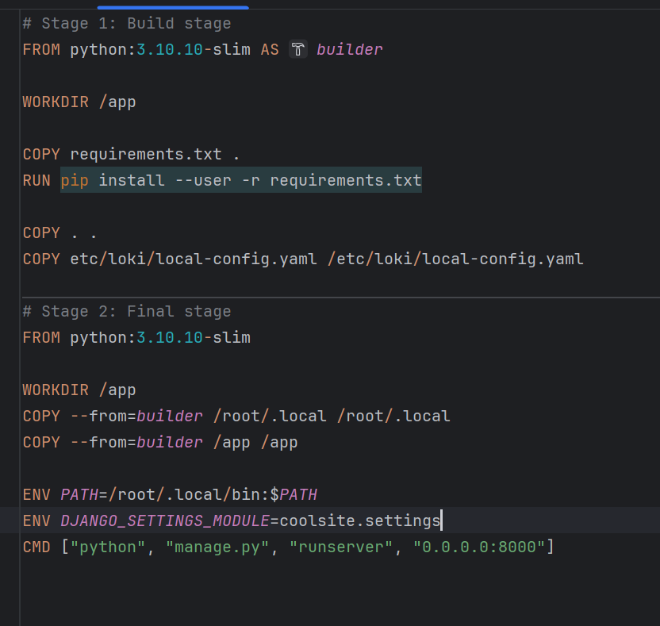
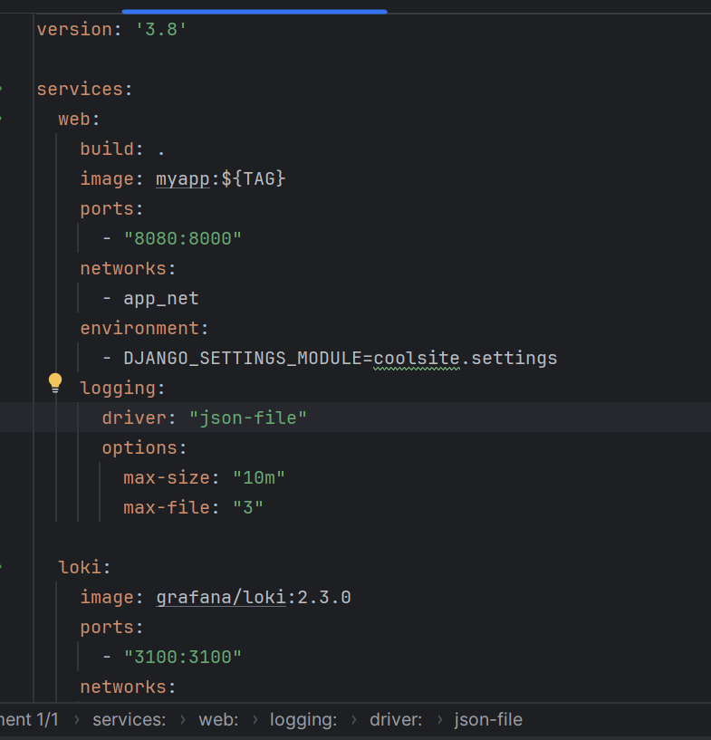
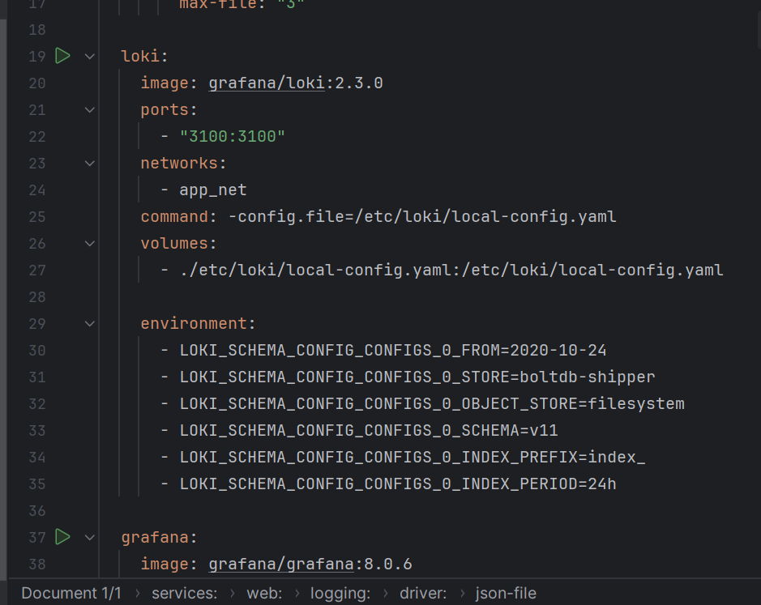
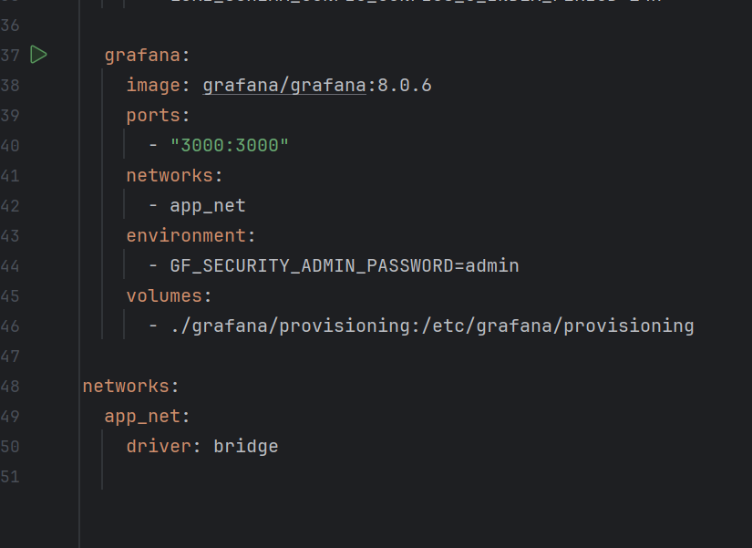
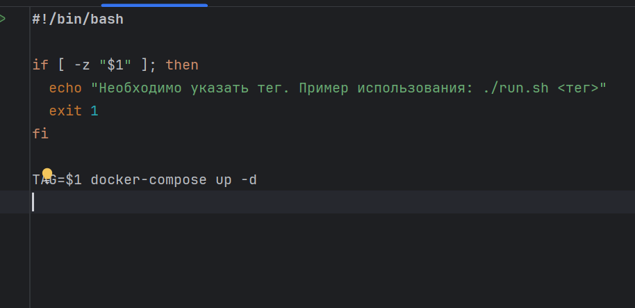
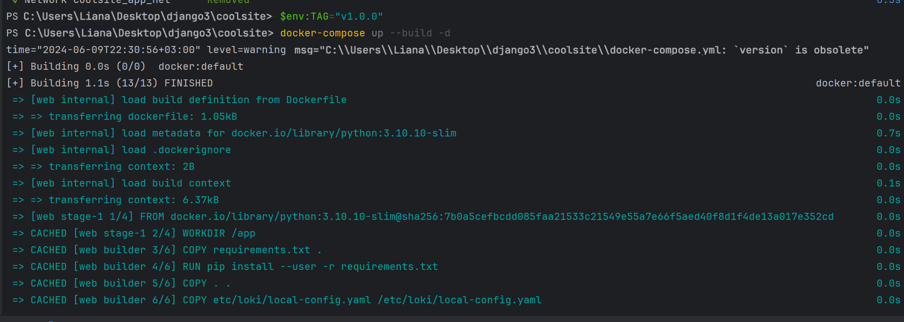
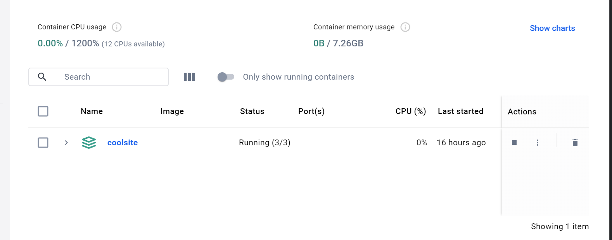
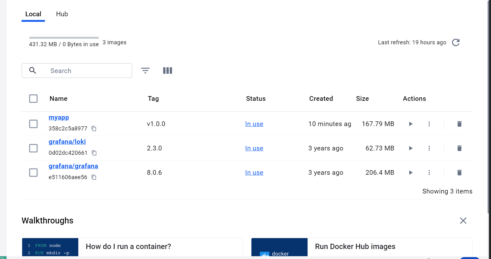
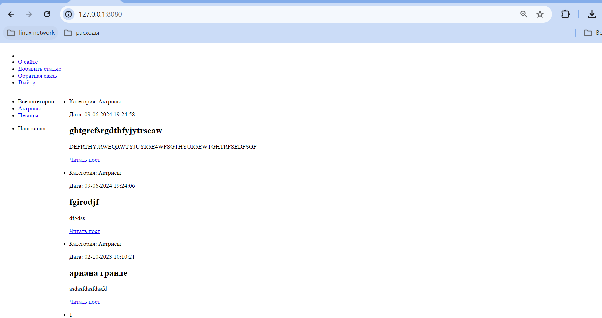
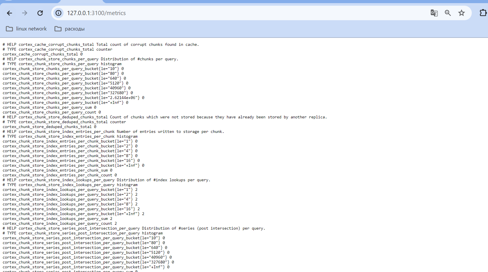

## Dockerfile

- Сборка зависимостей на стадии сборки.
- Перенос зависимостей и кода на финальную стадию.
- Настройка окружения и запуск Django-приложения.

## docker-compose.yml

- Сборка и запуск веб-приложения.
- Настройка Loki для сбора логов.
- Настройка Grafana для визуализации логов из Loki.

## grafana/provisioning/datasources/loki.yaml

- Этот YAML файл настраивает Loki как источник данных в Grafana:
- Grafana будет использовать Loki для сбора и отображения логов.

## build.sh

- Убеждаемся, что пользователь передал необходимый аргумент (тег) при запуске скрипта. Если тег не передан, скрипт выводит подсказку и завершает работу

## run.sh

- запуск Docker Compose с указанным тегом для сборки и запуска контейнеров в фоновом режиме.

### запускаем 

### контейнер

### образы 

### сайт
-- все работает как и раньше

### Loki

